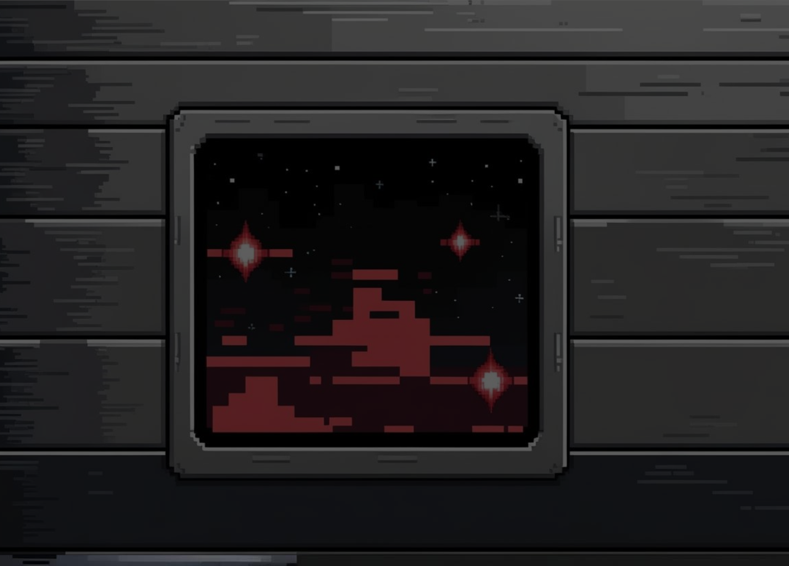

# GravityRooms

---

Federal University of Technology - Paraná (2024-2025)

---

Developed by:

Nícolas Auersvalt Marques

Isabela Bella Bortoleto

---

[Video de Gameplay](https://www.youtube.com/watch?v=8P1LvGM78JY)

---

## Requisitos Mínimos

Antes de instalar o jogo, certifique-se de ter as seguintes ferramentas instaladas no seu sistema:

CMake: Ferramenta de automação de compilação (3.22.1).

Make: Sistema de compilação (GNU Make 4.3).

Compilador C++: Recomendado o g++ ou clang++ (g++ (Ubuntu 11.4.0-1ubuntu1~22.04) 11.4.0).

SFML 2.5.1 (Audio, Graphics, Network, System, Window)

## Instalação

Para baixar o jogo, use:

    mkdir GravityRooms && cd GravityRooms
    git clone https://github.com/NicolasAuersvalt/GravityRooms.git
    cd GravityRooms

Para instalar o jogo, execute o script `install.sh`:

    chmod +x install.sh
    ./install.sh

---

## Execução

Após a instalação, para rodar o jogo, utilize:

    ./build.sh

Uma vez construído, basta:

    ./run.sh
    
---

## Debug

Para rodar o jogo em modo de depuração, utilize:

    ./debug.sh

---

## Descrição

A disciplina de **Técnicas de Programação** exige o desenvolvimento de um software de plataforma, no formato de um jogo, para fins de aprendizado de técnicas de engenharia de software, particularmente de programação orientada a objetos em C++.

Para este trabalho, escolheu-se o **jogo GravityRooms**, onde o jogador enfrenta inimigos na espaçonave **Thalos I**. O jogo possui duas fases, que se diferenciam pela dificuldade apresentada ao jogador.

## Requisitos e Modelagem

O desenvolvimento do jogo foi realizado com base nos requisitos textualmente propostos e uma modelagem (análise e projeto) via **Diagrama de Classes em UML**. A modelagem foi feita com base em um diagrama genérico e prévio proposto.

## Desenvolvimento

O jogo foi desenvolvido em **C++** e contemplou os seguintes conceitos de programação orientada a objetos:

- **Classe**
- **Objeto**
- **Relacionamento entre objetos**
- **Classe Abstrata**
- **Polimorfismo**
- **Gabaritos (Templates)**
- **Persistência de Objetos por Arquivos**
- **Sobrecarga de Operadores**
- **Biblioteca Padrão de Gabaritos (STL)**

## Funcionalidade

Após a implementação do jogo, foram realizados testes pelos próprios desenvolvedores, demonstrando que o jogo funciona conforme os requisitos e a modelagem elaborada.

## Objetivo de Aprendizado

O desenvolvimento do jogo permitiu o cumprimento do objetivo de aprendizado proposto na disciplina, utilizando técnicas avançadas de programação orientada a objetos e C++.

# Jogo de Plataforma - Desenvolvimento com SFML e UML

## Introdução

Para a melhor compreensão dos conteúdos abordados na disciplina de **Técnicas de Programação**, foi necessário o desenvolvimento de um jogo fundamentado nos princípios básicos do ciclo de **Engenharia de Software**, com ênfase na **modelagem em UML**. Este projeto tem como objetivo consolidar os conhecimentos adquiridos ao longo do curso, proporcionando uma aplicação prática dos conceitos estudados.

### Objetivo do Projeto

O objetivo principal é a criação de um jogo de plataforma com estética pixelada, desenvolvido utilizando a biblioteca **SFML** em **C++**. A SFML (Simple and Fast Multimedia Library) oferece ferramentas adequadas para a construção de ambientes gráficos interativos, permitindo experimentação e testes dentro do contexto da disciplina.

### Desenvolvimento do Jogo

O desenvolvimento do jogo segue um regulamento específico, exigindo a interpretação e adaptação dos conceitos de **programação orientada a objetos**. Também foi utilizado **UML** para modelagem do sistema, de forma a garantir uma arquitetura organizada e eficaz.

Além da implementação técnica, o projeto inclui:

- **Planejamento em grupo**, promovendo uma abordagem colaborativa.
- **Análise detalhada dos requisitos**, assegurando que o produto final atenda aos objetivos.
- **Processo simplificado do ciclo de Engenharia de Software**, que abrange:
  - Compreensão dos requisitos
  - Modelagem com diagramas de classes UML
  - Implementação em C++
  - Testes do software

### Metodologia

O desenvolvimento seguiu uma abordagem estruturada e colaborativa, sendo que cada etapa do ciclo de Engenharia de Software foi abordada com foco na aplicação de conceitos de orientação a objetos.

### Estrutura do Relatório

O relatório a seguir está organizado da seguinte forma:

1. **Panorama sobre o Tema do Jogo**: Introdução ao conceito do jogo e seu enredo.
2. **Explicação Técnica Geral do Projeto**: Descrição dos métodos adotados e das ferramentas utilizadas.
3. **Detalhamento das Seções Subsequentes**: Explicação das etapas específicas do processo de desenvolvimento.

Este projeto não apenas proporciona a aplicação de técnicas de programação, mas também promove o aprendizado prático das metodologias de Engenharia de Software.

# Explicação do Jogo - GravityRooms

## Tema e Filosofia

**GravityRooms** é um jogo que adota como temática central uma abordagem filosófica da **metafísica**, com ênfase no pensamento do filósofo **Martin Heidegger**. O jogo propõe reflexões sobre questões fundamentais da existência, como:

- **"O que é o ser?"**
- **"O que define a humanidade?"**
- **"Robôs possuem consciência?"**

Com essas questões, o jogo busca estimular uma discussão profunda e relevante para os tempos atuais, integrando filosofia e mecânicas de jogo de forma inovadora.

## Inimigos e Filosofia

O jogo conta com inimigos de **quantidade aleatória** e **limitada**, cada um com tipos exclusivos e níveis de dificuldade variados, representando diferentes aspectos da reflexão filosófica proposta. Os inimigos são:

### 1. **Ciborgue** (Dificuldade Baixa)
- **Descrição**: Um humano com partes robóticas.
- **Reflexão Filosófica**: "Até que ponto um humano pode se tornar artificial sem deixar de ser humano?"
- **Características**: Inimigo de menor dificuldade, introduzindo o jogador ao conceito de mistura entre o biológico e o tecnológico.

### 2. **Andróide** (Dificuldade Média)
- **Descrição**: Um robô projetado para imitar um humano.
- **Reflexão Filosófica**: "Um robô pode ter consciência?"
- **Características**: Inimigo de dificuldade intermediária, levantando a questão da consciência em máquinas e a natureza da imitação.

### 3. **Clone** (Dificuldade Alta)
- **Descrição**: Uma cópia exata de um humano.
- **Reflexão Filosófica**: "Um clone é um ser humano?"
- **Características**: O inimigo mais desafiador, que ataca com projéteis e traz à tona dilemas éticos e existenciais sobre a natureza da identidade e a criação de cópias humanas.

## Dinâmica do Jogo

Os inimigos aparecem em uma **quantidade aleatória por fase**, e cada tipo de inimigo possui **pontos de vida específicos**, oferecendo uma experiência de jogo única a cada vez. O jogo não só desafia os jogadores com sua mecânica, mas também os convida a refletir sobre questões filosóficas profundas enquanto enfrentam esses inimigos.

O jogo promove uma reflexão contínua e crescente sobre o que significa ser humano, o que é a consciência e o papel da tecnologia na sociedade moderna.

## Obstáculos no Jogo

Além dos inimigos, o jogo apresenta **obstáculos variados**, que são gerados de forma **aleatória** e **limitados em número**. Entre os obstáculos, destacam-se:

- **Plataformas**: Superfícies nas quais o jogador pode se mover.
- **Espinhos**: Obstáculos que podem eliminar o jogador instantaneamente ao entrar em contato com eles.
- **Espinhos Retráteis**: Espinhos que ativam e desativam ao longo do tempo, aumentando a complexidade do movimento.
- **Regiões Gravitacionais**: Áreas que exercem uma forte atração sobre o jogador, resultando na morte do personagem se o jogador não agir rapidamente.

Esses obstáculos adicionam um elemento estratégico ao jogo, exigindo que o jogador tenha atenção não só aos inimigos, mas também ao ambiente ao seu redor.

## Jogabilidade

O jogador assume o papel de um **tripulante da nave**, com a capacidade de **atirar nos inimigos**, assim como seu **clone**. As principais mecânicas de jogabilidade incluem:

- **Pular**: O jogador pode pular para evitar obstáculos e alcançar plataformas.
- **Resistência limitada**: O jogador tem pouca resistência, o que significa que deve ser estratégico em seus movimentos e ações.
- **Munição limitada**: A munição para atirar é limitada, tornando a gestão de recursos uma parte essencial da estratégia do jogo.

Todos os inimigos presentes no jogo perseguem o jogador, com **quantidades de vida variáveis**, proporcionais ao nível de dificuldade da fase.

### Controles

- **Jogador 1**:
  - Mover-se: **← → ↓**
  - Pular: **Enter**
  - Atirar: **Q**

- **Jogador 2** (ativado pressionando **M**):
  - Mover-se: **W A S D**
  - Atirar: **Z**

- **Menu de Pausa**: **Esc**
- **Confirmações no Jogo**: **Enter**

Esses controles permitem que o jogador tenha uma experiência fluida e dinâmica, adaptável tanto para um jogador quanto para dois jogadores, criando um ambiente de jogo cooperativo ou competitivo.

## Obstáculos Adicionais: Centro Gravitacional

Além dos **espinhos**, que causam dano instantâneo no jogador, o jogo apresenta o **Centro Gravitacional**, um objeto que possui uma lógica específica de interação com o jogador.

### Lógica do Centro Gravitacional

Quando o **Tripulante** colide com o **Centro Gravitacional**, é calculado um dano relativo à **velocidade final do jogador**. Esse dano é uma função da velocidade com a qual o jogador entrou em contato com a região gravitacional, tornando a interação com este objeto ainda mais estratégica.

### Cálculo do Dano

O cálculo do dano segue uma fórmula que leva em consideração a **velocidade final** do jogador ao colidir com o Centro Gravitacional. O dano é proporcional à velocidade com que o jogador entra na área de influência gravitacional, aumentando conforme o impacto.

## Espinhos Retráteis

Os **espinhos retráteis** apresentam uma mecânica dinâmica de ativação e desativação:

- **Quando ativos**, os espinhos ficam com **cor vermelha**, causando **dano no jogador** ao entrar em contato com eles.
- **Quando inativos**, os espinhos ficam com **cor verde**, **não causando dano** ao jogador, permitindo a passagem sem riscos.

Esse comportamento introduz uma dinâmica de tempo, onde o jogador deve observar o movimento dos espinhos para avançar sem sofrer danos.

## Menu de Seleção de Fase

Na tela inicial do jogo, o jogador pode selecionar a fase desejada utilizando as **setas do teclado** (←↑→↓) e pressionando **Enter** para confirmar a escolha. 

- Cada fase possui um **inimigo** e um **obstáculo exclusivo**, proporcionando uma experiência de jogo variada e desafiadora a cada escolha de fase.

## Ranking de Jogadores

Ao morrer, o jogador tem a opção de **digitar seu nome** e pressionar **Enter** para salvar sua pontuação. As pontuações são armazenadas em um **ranking final**, que pode ser acessado no **menu de Ranking**.

- As pontuações são **salvas de forma polimórfica**, utilizando um arquivo de texto no formato **JSON**, garantindo flexibilidade e organização no armazenamento dos dados.

## Discussão e Conclusões

Durante o desenvolvimento do projeto, foi necessária a **adaptação do modelo UML** proposto para garantir o funcionamento adequado do jogo. A modelagem UML, juntamente com as **estratégias discutidas nas reuniões com o professor**, foi essencial para o andamento eficiente do desenvolvimento. Entre essas estratégias, destacam-se:

- **Criação preliminar de classes vazias** para estruturar os relacionamentos antes de sua implementação.
- **Documentação extensiva do código**, que facilitou a identificação e resolução de erros.
- **Formulação de relações temporárias entre classes**, possibilitando uma abordagem incremental e de desenvolvimento progressivo, do menos complexo para o mais complexo, similar ao modelo "Espiral".

### Contribuição dos Cursos do PETECO

Os **cursos do PETECO** proporcionaram uma visão antecipada dos desafios e das soluções possíveis, além de possibilitar a aquisição de novas técnicas e o aprimoramento das habilidades de trabalho em grupo. As reuniões com os monitores foram essenciais para a resolução de erros, além de fornecerem sugestões e revisões do código.

### Importância do Versionamento e Ferramentas Utilizadas

No contexto de trabalho em equipe, o **versionamento de código** e os **backups** mostraram-se indispensáveis. Eles possibilitaram:

- **Interação direta no código**, com comentários e explicações.
- **Recuperação de versões anteriores**.
- **Desenvolvimento simultâneo** por diferentes integrantes da equipe.

No entanto, foi necessário realizar um estudo preliminar sobre **compiladores** para compreender certos erros de código aparentemente insolúveis. Esse estudo revelou que problemas surgiam da forma como o compilador interpreta classes e relacionamentos, gerando erros fora do escopo da disciplina de Orientação a Objetos.

### Ferramentas Utilizadas

Além do **GitHub**, diversas outras ferramentas foram essenciais para o desenvolvimento eficiente do jogo, incluindo:

- **Neovim**, **CMake**, **gdb**.
- **ChatGPT**, **Dream Lab (Canva)**, **Photoshop**, **VSCode**.
- **LiveShare (VSCode)**, **clang-format**, **scripts (.sh)** e **JSON**.

### Modelo UML e Requisitos

A atualização contínua do modelo UML e o preenchimento simultâneo dos requisitos durante o desenvolvimento foram estratégias fundamentais para organizar e otimizar o tempo. Esse método facilitou a adaptação ao progresso do projeto, proporcionando uma visão clara do estado atual do desenvolvimento e permitindo a identificação de melhorias necessárias.

### Planejamento e Testes

A **interpretação do modelo** e dos requisitos revelou-se um ponto sensível, exigindo uma análise prévia e planejamento estratégico tanto das **classes em desenvolvimento** quanto de seus **relacionamentos**. A possibilidade de modificações em “classes folhas” nas etapas iniciais do projeto permitiu o aprimoramento de métodos e testes temporários nas classes internas e bases.

### Validação de Funções e Coesão/Desacoplamento

Conforme discutido nas reuniões com o professor, a **validação de classes ou funções** seguiu a abordagem de testá-las em estruturas simples, sem relacionamentos diretos, ou com adaptações mínimas. Isso permitiu experimentar operações e metodologias antes de sua aplicação definitiva, promovendo um desenvolvimento mais **modular** e **organizado**.

Os conceitos de **coesão** e **desacoplamento** estruturaram uma nova perspectiva no desenvolvimento do projeto, permitindo a aplicação de boas práticas de design. No entanto, a implementação integral desses princípios foi limitada pela biblioteca utilizada e pela necessidade de modificações abrangentes em namespaces completos. Essa limitação destacou a importância de planejar a **coesão** e o **desacoplamento** já na modelagem UML, pois dificuldades nesse estágio podem impactar significativamente o tempo de desenvolvimento.

### Conclusão

Seguir uma **tabela de requisitos** mostrou-se uma forma eficaz de dimensionar o resultado final, pois ao contabilizar a quantidade de requisitos, foi possível estipular a **qualidade final** do projeto.

## Contexto e Planejamento

(V) Escolher o jogo de plataforma a ser desenvolvido.

(V) Validar a escolha do jogo com o professor.

(V) Planejar as fases, obstáculos, inimigos e funcionalidades.

## Requisitos Funcionais do Jogo

(V) Criar menu gráfico com:

(V) Opções de seleção de fases. (Observer: Menu)

(V) Exibição do ranking de jogadores.

(V) Outras funcionalidades pertinentes.

(V) Implementar suporte para:

(V) Um jogador.

(V) Dois jogadores (opcional ou parcialmente realizado).

(V) Desenvolver ao menos duas fases jogáveis:

(V) Fases com diferentes dificuldades.

(V) Fases com obstáculos e inimigos variados.

(V) Incluir pelo menos três tipos de inimigos:

(V) Um inimigo capaz de lançar projéteis.

(V) Um chefão.

(V) Adicionar no mínimo três tipos de obstáculos:

(V) Obstáculos que causem dano ao jogador.

(V) Implementar física básica:

(V) Efeito de gravidade.

(V) Detecção de colisões entre jogadores, inimigos e obstáculos. (Mediator: Gerenciador de Colisões)

(V) Incluir persistência de dados:

(V) Salvar nome do jogador e pontuação.

(V) Salvar e recuperar estado do jogo.

(V) Gerar ranking.

## Modelagem e Projeto

(V) Elaborar diagrama de classes em UML:

(V) Baseado no modelo fornecido.

(V) Melhorar e expandir conforme necessário.

(V) Validar o diagrama com o professor.

## Implementação

(V) Desenvolver o jogo em C++.

(V) Utilizar uma biblioteca gráfica (preferencialmente SFML).

(V) Aplicar conceitos de orientação a objetos:

(V) Classes e objetos.

(V) Herança e polimorfismo. (Template Method: Hierarquia de Ente, Entidade, Personagem)

(V) Encapsulamento e coesão.

(V) Desacoplamento. (Bridge: Relação entre Ente e Interface Gráfica)

(V) Implementar funcionalidades gráficas e interativas.

## Documentação

(V) Seguir o modelo de formatação fornecido.

(V) Escrever as seguintes seções no documento:

(V) Introdução:

(V) Contexto e objetivo do trabalho.

(V) Objeto de estudo.

(V) Método utilizado.

(V) Estrutura do documento.

(V) Explicação do Jogo:

(V) Tela e funcionalidades principais.

(V) Figuras e telas do jogo.

(V) Desenvolvimento:

(V) Requisitos funcionais atendidos.

(V) Descrição do diagrama de classes.

(V) Principais classes e sua interação.

(V) Reflexão comparativa (se aplicável):

(V) Comparação com desenvolvimento procedimental.

(V) Discussão e Conclusões:

(V) Reflexão sobre dificuldades e resultados.

(V) Considerações pessoais (opcional).

(V) Divisão de tarefas:

(V) Tabela com atividades e responsáveis.

(V) Revisar o documento para evitar erros de português e formatação.

## Reuniões e Interações

(V) Realizar pelo menos duas reuniões com o professor.

(V) Realizar quatro reuniões com o monitor.

(V) Registrar e enviar resumos das reuniões por e-mail.

## Apresentação

(V) Preparar os slides (.ppt ou .pdf).

(V) Ensaiar a apresentação do trabalho.

## Entrega

(V) Enviar:

(V) Documento escrito (.docx e .pdf).

(V) Diagrama(s) de classes (digital e impresso).

(V) Código-fonte do jogo.

(V) Slides da apresentação.

(V) Utilizar plataformas seguras para envio (preferencialmente Google Drive institucional).

## Padrões de Software Aplicados

( ) (Adapter: Coordenadas)

( ) (Observer: Notificações, Gerenciador de Eventos, Menu)

( ) (Mediator: Gerenciador de Colisões)

(V) (Template Method: Hierarquia de Ente, Entidade, Personagem)

( ) (Builder: Construção de entidades na fase)

## Conceitos

(V) - Classes, objetos. & - Atributos (privados), variáveis e constantes - Métodos (com e sem retorno).

(V) Métodos (com retorno const e parâmetro const) & Construtores (sem/com parâmetros) e destrutores

(V) Classe Principal.

(V) Divisão em .h e .cpp.

(V) Associação direcional. & - Associação bidirecional.

(V) Agregação via associação. & - Agregação propriamente dita.

(V) Herança elementar. & - Herança em vários níveis.

(V) Herança múltipla.

(V) Operador this para fins de relacionamento bidirecional.

(V) Alocação de memória (new & delete).

(V) Gabaritos/Templates criada/adaptados pelos autores para Listas.

(V) Uso de Tratamento de Exceções (try catch).

(V) Construtoras e Métodos.

(V) Operadores (2 tipos de operadores pelo menos)

(V) Persistência de Objetos. 

(V) Persistência de Relacionamento de Objetos.

(V) Métodos Virtuais Usuais.

(V) Polimorfismo.

(V) Métodos Virtuais Puros / Classes Abstratas.

( ) Coesão/Desacoplamento efetiva e intensa com o apoio de padrões de projeto (mais de 5 padrões). 

(V) Espaço de Nomes (Namespace) criada pelos autores.

(V) Classes aninhadas (Nested) criada pelos autores.

(V) Atributos estáticos e métodos estáticos.

(V) Uso extensivo de constante (const) parâmetro, retorno, método...

(V) A classe Pré-definida  String ou equivalente. & - Vector e/ou List da STL (p/ objetos ou ponteiros de objetos de classes definidos pelos autores)

(V) Pilha, Fila, Bifila, Fila de Prioridade, Conjunto, Multi-Conjunto, Mapa OU Multi-Mapa.

( ) Threads (Linhas de Execução) no âmbito da Orientação a Objetos, utilizando Posix, C-Run-Time OU Win32API ou afins.

(V) Threads (Linhas de Execução) no âmbito da Orientação a Objetos com uso de Mutex, Semáforos, OU Troca de mensagens.

(V) Funcionalidades Elementares. & Funcionalidades Avançadas como: tratamento de colisões e duplo buffer

( ) Programação orientada e evento efetiva (com gerenciador apropriado de eventos inclusive, via padrão de projeto Observer) em algum ambiente gráfico. OU - RAD – Rapid Application Development (Objetos gráficos como formulários, botões etc).

(V) Ensino Médio Efetivamente.

(V) Ensino Superior Efetivamente.

(V) Compreensão, melhoria e rastreabilidade de cumprimento de requisitos.

(V) Diagrama de Classes em UML.

( ) Uso efetivo e intensivo de padrões de projeto GOF, i.e., + de 5 padrões.

(V) Testes à luz da Tabela de Requisitos e do Diagrama de Classes.

(V) Controle de versão de modelos e códigos automatizado (via github) e uso de alguma forma de cópia de segurança (i.e., backup).

(V) Reuniões com o professor para acompanhamento do andamento do projeto. [ITEM OBRIGATÓRIO A ENTREGA DO TRABALHO]

(V) Reuniões com monitor da disciplina para acompanhamento do andamento do projeto. [ITEM OBRIGATÓRIO PARA A ENTREGA]

(V)Escrita do trabalho e feitura da apresentação & Revisão do trabalho escrito de outra equipe e vice-versa.

