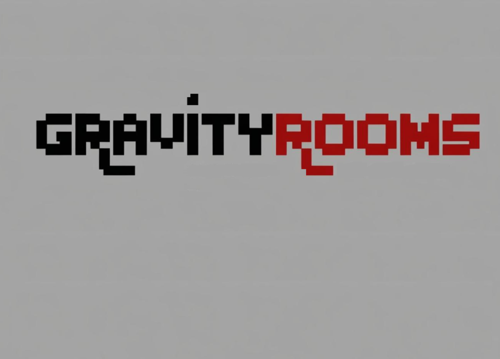

# GravityRooms

Federal University of Technology - Paraná (2024-2025)

---

Developed by:

Nícolas Auersvalt Marques

Isabela Bella Bortoleto

---

# Requisitos Mínimos

Antes de instalar o jogo, certifique-se de ter as seguintes ferramentas instaladas no seu sistema:

CMake: Ferramenta de automação de compilação (3.22.1).

Make: Sistema de compilação (GNU Make 4.3).

Compilador C++: Recomendado o g++ ou clang++ (g++ (Ubuntu 11.4.0-1ubuntu1~22.04) 11.4.0).

SFML 2.5.1 (Audio, Graphics, Network, System, Window)

## Instalação

Para instalar o jogo, execute o script `install.sh`:

    chmod +x install.sh
    ./install.sh

---

## Execução

Após a instalação, para rodar o jogo, utilize:

    ./build.sh

---

## Debug

Para rodar o jogo em modo de depuração, utilize:

    ./debug.sh

---

## Contexto e Planejamento

(V) Escolher o jogo de plataforma a ser desenvolvido.

(V) Validar a escolha do jogo com o professor.

(V) Planejar as fases, obstáculos, inimigos e funcionalidades.

## Requisitos Funcionais do Jogo

(V) Criar menu gráfico com:

(V) Opções de seleção de fases. (Observer: Menu)

( ) Exibição do ranking de jogadores.

(V) Outras funcionalidades pertinentes.

( ) Implementar suporte para:

(V) Um jogador.

( ) Dois jogadores (opcional ou parcialmente realizado).

(V) Desenvolver ao menos duas fases jogáveis:

(V) Fases com diferentes dificuldades.

(V) Fases com obstáculos e inimigos variados.

(V) Incluir pelo menos três tipos de inimigos:

(V) Um inimigo capaz de lançar projéteis.

(V) Um chefão.

(V) Adicionar no mínimo três tipos de obstáculos:

(V) Obstáculos que causem dano ao jogador.

(V) Implementar física básica:

(V) Efeito de gravidade.

(V) Detecção de colisões entre jogadores, inimigos e obstáculos. (Mediator: Gerenciador de Colisões)

( ) Incluir persistência de dados:

(V) Salvar nome do jogador e pontuação.

(V) Salvar e recuperar estado do jogo.

( ) Gerar ranking.

## Modelagem e Projeto

(V) Elaborar diagrama de classes em UML:

(V) Baseado no modelo fornecido.

(V) Melhorar e expandir conforme necessário.

( ) Validar o diagrama com o professor.

## Implementação

(V) Desenvolver o jogo em C++.

(V) Utilizar uma biblioteca gráfica (preferencialmente SFML).

(V) Aplicar conceitos de orientação a objetos:

(V) Classes e objetos.

(V) Herança e polimorfismo. (Template Method: Hierarquia de Ente, Entidade, Personagem)

(V) Encapsulamento e coesão.

(V) Desacoplamento. (Bridge: Relação entre Ente e Interface Gráfica)

(V) Implementar funcionalidades gráficas e interativas.

## Documentação

(V) Seguir o modelo de formatação fornecido.

( ) Escrever as seguintes seções no documento:

( ) Introdução:

( ) Contexto e objetivo do trabalho.

( ) Objeto de estudo.

( ) Método utilizado.

( ) Estrutura do documento.

( ) Explicação do Jogo:

( ) Tela e funcionalidades principais.

( ) Figuras e telas do jogo.

( ) Desenvolvimento:

( ) Requisitos funcionais atendidos.

( ) Descrição do diagrama de classes.

( ) Principais classes e sua interação.

( ) Reflexão comparativa (se aplicável):

( ) Comparação com desenvolvimento procedimental.

( ) Discussão e Conclusões:

( ) Reflexão sobre dificuldades e resultados.

( ) Considerações pessoais (opcional).

(V) Divisão de tarefas:

( ) Tabela com atividades e responsáveis.

( ) Revisar o documento para evitar erros de português e formatação.

## Reuniões e Interações

(V) Realizar pelo menos duas reuniões com o professor.

( ) Realizar quatro reuniões com o monitor.

(V) Registrar e enviar resumos das reuniões por e-mail.

## Apresentação

(V) Preparar os slides (.ppt ou .pdf).

( ) Ensaiar a apresentação do trabalho.

## Entrega

( ) Enviar:

( ) Documento escrito (.docx e .pdf).

( ) Diagrama(s) de classes (digital e impresso).

( ) Código-fonte do jogo.

( ) Slides da apresentação.

( ) Utilizar plataformas seguras para envio (preferencialmente Google Drive institucional).

## Padrões de Software Aplicados

( ) (Adapter: Coordenadas)

( ) (Observer: Notificações, Gerenciador de Eventos, Menu)

( ) (Mediator: Gerenciador de Colisões)

( ) (Template Method: Hierarquia de Ente, Entidade, Personagem)

( ) (Builder: Construção de entidades na fase)

## Conceitos

(V) - Classes, objetos. & - Atributos (privados), variáveis e constantes - Métodos (com e sem retorno).

(V) Métodos (com retorno const e parâmetro const) & Construtores (sem/com parâmetros) e destrutores

(V) Classe Principal.

(V) Divisão em .h e .cpp.

(V) Associação direcional. & - Associação bidirecional.

(V) Agregação via associação. & - Agregação propriamente dita.

(V) Herança elementar. & - Herança em vários níveis.

( ) Herança múltipla.

(V) Operador this para fins de relacionamento bidirecional.

(V) Alocação de memória (new & delete).

(V) Gabaritos/Templates criada/adaptados pelos autores para Listas.

(V) Uso de Tratamento de Exceções (try catch).

(V) Construtoras e Métodos.

(V) Operadores (2 tipos de operadores pelo menos)

(V) Persistência de Objetos. 

(V) Persistência de Relacionamento de Objetos.

(V) Métodos Virtuais Usuais.

(V) Polimorfismo.

(V) Métodos Virtuais Puros / Classes Abstratas.

( ) Coesão/Desacoplamento efetiva e intensa com o apoio de padrões de projeto (mais de 5 padrões). 

(V) Espaço de Nomes (Namespace) criada pelos autores.

(V) Classes aninhadas (Nested) criada pelos autores.

(V) Atributos estáticos e métodos estáticos.

(V) Uso extensivo de constante (const) parâmetro, retorno, método...

(V) A classe Pré-definida  String ou equivalente. & - Vector e/ou List da STL (p/ objetos ou ponteiros de objetos de classes definidos pelos autores)

(V) Pilha, Fila, Bifila, Fila de Prioridade, Conjunto, Multi-Conjunto, Mapa OU Multi-Mapa.

(V) Threads (Linhas de Execução) no âmbito da Orientação a Objetos, utilizando Posix, C-Run-Time OU Win32API ou afins.

(V) Threads (Linhas de Execução) no âmbito da Orientação a Objetos com uso de Mutex, Semáforos, OU Troca de mensagens.

(V) Funcionalidades Elementares. & Funcionalidades Avançadas como: tratamento de colisões e duplo buffer

( ) Programação orientada e evento efetiva (com gerenciador apropriado de eventos inclusive, via padrão de projeto Observer) em algum ambiente gráfico. OU - RAD – Rapid Application Development (Objetos gráficos como formulários, botões etc).

(V) Ensino Médio Efetivamente.

(V) Ensino Superior Efetivamente.

(V) Compreensão, melhoria e rastreabilidade de cumprimento de requisitos.

(V) Diagrama de Classes em UML.

( ) Uso efetivo e intensivo de padrões de projeto GOF, i.e., + de 5 padrões.

(V) Testes à luz da Tabela de Requisitos e do Diagrama de Classes.

(V) Controle de versão de modelos e códigos automatizado (via github) e uso de alguma forma de cópia de segurança (i.e., backup).

(V) Reuniões com o professor para acompanhamento do andamento do projeto. [ITEM OBRIGATÓRIO A ENTREGA DO TRABALHO]

(V) Reuniões com monitor da disciplina para acompanhamento do andamento do projeto. [ITEM OBRIGATÓRIO PARA A ENTREGA]

( )Escrita do trabalho e feitura da apresentação & Revisão do trabalho escrito de outra equipe e vice-versa.

